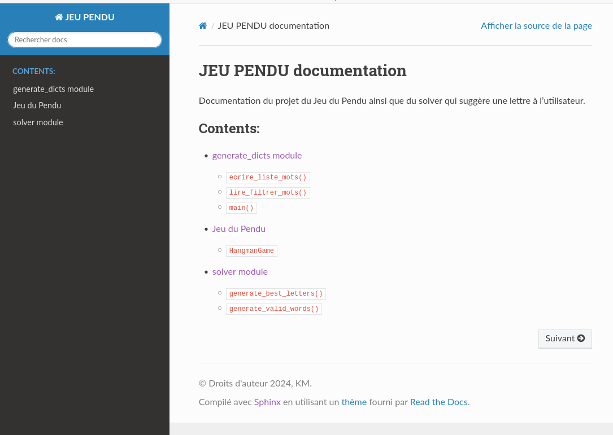

# Examen Solver pour Pendu

Le code le jeu est inspiré de [geeksforgeeks](https://www.geeksforgeeks.org/hangman-game-with-a-gui-in-python/).  
Les images du pendu viennent de [wikipedia](https://commons.wikimedia.org/wiki/File:Hangman-0.png#file).  
Les mots de `data/liste-mots.txt` viennent d' [ici](https://github.com/SinaC/Lexique/blob/master/WordList/liste-mots-alphabetique.txt).

Par: Kévin MICHOUD

Vendredi 25 Octobre 2024

Data limite : Vendredi 13 décembre 2024

## Présentation
Le projet est un jeu de pendu basique développé en python à l'aide la librairie [Pygame](https://pypi.org/project/pygame/).
```bash
pip install pygame 
```

Sur les machines de la salle S404 ajoutez `--user`, car vous n'avez pas les droits administrateur

```bash
pip install pygame --user # On ajoute user sur les machines de la S404
```

Pour lancer le jeu, il suffit d’exécuter le fichier `hangman.py` à l'aide python.
Par ex. dans le terminal:

```bash
python hangman.py
```
Le jeu utilise 5 fichiers contenant des mots de taille variable (entre 6 et 10 lettres). Ces mots servent de mot mystère que l'utilisateur doit devenir. A chaque partie, une nouvelle longueur est tirée au sort puis un mot parmi le dictionnaire correspondant.  

## Examen
L'examen est divisé en 4 parties: 
1. Une partie du **code**  (5 points) consiste à compléter les scripts solver.py et generate_dicts.py. Le script generate_dicts.py lit un fichier texte et crée des listes de mots en fonction de leur longueur. Le script solver.py permet de conseiller l'utilisateur sur le meilleur choix de lettre à jouer.
2. Une partie **git**   (5 points) qui consiste à montrer votre compréhension en forkant le dépôt de code, en le clonant sur votre machine, en faisant des commit puis le poussant vers votre dépôt à distance. 
3. Une partie **test** (5 points)  montrera votre compréhension des tests avec `pytest`.
4. Enfin, une partie **documentation** (5 points) consistera à générer la documentation des scripts python du projet.

## I. Code

***Toutes les fonctions doivent contenir une docstring et des type hints.***

Vous devez écrire la fonction `lire_filtrer_mots` dans `generate_dicts.py` :

```python
def lire_filtrer_mots(chemin_lexique, longueur):
    return []
```

### I.1 Script `generate_dicts` (1 point)

1. **Fonction `lire_filtrer_mots`** :
   - Cette fonction doit lire tous les mots d'un fichier texte (le fichier fourni dans `chemin_lexique`).
   - Elle doit **filtrer** les mots pour ne conserver que ceux ayant la longueur spécifiée (par exemple, 6, 7, 8, 9 ou 10 lettres).
   - Les mots doivent être nettoyés en :
     - **Supprimant les accents**, les espaces, et les tirets.
     - Éliminant les doublons.
   - La fonction retourne une **liste Python** contenant uniquement les mots valides en majuscule ayant la taille spécifiée.

2. **Processus global** :

- **Écrire la fonction `lire_filtrer_mots`**: elle lit les mots depuis le fichier source (par exemple `data/liste_mots.txt`) et applique un filtre pour retourner une liste de mots d'une longueur donnée.
- **Exécuter le script**: pour générer les fichiers texte (par exemple, `dico_6_lettres.txt`, `dico_7_lettres.txt`, etc.), il suffit d'exécuter le script `generate_dicts.py` une fois que la fonction `lire_filtrer_mots` est écrite, car les deux autres fonctions ont déjà été écrites.

---

**Note** : Les fichiers `dico_6_lettres.txt` à `dico_10_lettres.txt` présents initialement dans le dossier `data/` contiennent seulement 10 mots pour que le programme puisse fonctionner. Vous devez recréer ces fichiers à partir de la liste complète des mots fournie dans `data/liste_mots.txt`.

### I.2 Script `solver.py` (4 points)

Vous devez écrire deux fonctions dans `solver.py` :

```python
def generate_valid_words(possible_words, letters_in_secret, letters_not_in_secret):
    return []

def generate_best_letters(possible_words: list, letters_not_played: list[str], letters_in_secret, letters_not_in_secret):
    return "Ajoutez votre suggestion de lettre à jouer ici"
```

Ces fonctions sont importées dans `hangman.py` pour générer l'indice donné à l'utilisateur pendant la partie. La fonction `generate_best_letters` retourne directement une chaîne de caractères qui est affichée dans le jeu pour conseiller l'utilisateur sur la prochaine lettre à jouer.

#### Fonction `generate_valid_words` (2 points)

En fonction des lettres déjà jouées, cette fonction permet d'obtenir la liste des mots encore valides.

- **Entrées** :
  - `possible_words` : La liste des mots potentiellement valides (par exemple, au départ, tous les mots d'une longueur donnée).
  - `letters_in_secret` : Une liste de tuples représentant les lettres déjà trouvées par l'utilisateur ainsi que leur position dans le mot. 
    - Par ex., si l'utilisateur a joué un B et A que le mot commence par BA `letters_in_secret = [(B,0), (A,1)]`
  - `letters_not_in_secret` : Une liste des lettres déjà essayées par l'utilisateur mais qui ne sont pas dans le mot. 
    - Par exemple, si il n'y a pas de C de D et de F: `letters_not_in_secret` = ['C', 'D', 'F']
  
- **But** :
  Cette fonction doit retourner une liste de mots qui respectent les contraintes suivantes :
  1. **Lettres exclues** : Les mots contenant une lettre présente dans `letters_not_in_secret` doivent être exclus.
  2. **Lettres bien placées** : Seuls les mots ayant les lettres à la bonne position, comme indiqué par `letters_in_secret`, doivent être conservés.

L'idée est de parcourir la liste des mots possibles et de retirer ceux qui :
- Contiennent une lettre exclue.
- Ne respectent pas les positions des lettres déjà trouvées par l'utilisateur. si `letters_in_secret = [(A, 0), (B, 2)]`,  on exclut les mots qui ne commencent pas par un A <u>et</u> les mots qui n'ont pas un B en troisième position.

#### Fonction `generate_best_letters` (2 points)

Cette fonction suggère à l'utilisateur quelle lettre jouer ensuite, en se basant sur la liste des mots valides générée par `generate_valid_words`. Elle prend les paramètres suivants (vous n'êtes pas obligés de tous les utiliser) :
- `possible_words` : La liste des mots encore en jeu après application des règles de `generate_valid_words`.
- `letters_not_played` : Une liste de lettres que l'utilisateur n'a pas encore essayées.
- `letters_in_secret` : La liste des lettres correctement placées dans le mot, avec leurs positions. 
- `letters_not_in_secret` : La liste des lettres qui ne sont pas dans le mot. 

Cette fonction retourne une suggestion sous forme de chaîne de caractères, qui est directement affichée dans le jeu pour guider l'utilisateur vers la meilleure lettre à jouer.

#### Stratégie pour la fonction `generate_best_letters`

Vous êtes libres d'écrire cette fonction selon votre préférence. Pensez à écrire une docstring et des type hint qui correspondent à ce que fais la fonction. Voici 3 suggestions.

#### 1. **Niveau facile : Choisir la lettre jouable la plus fréquente de la langue française**  (1 / 2 points)
   - **Principe** : On récupérer la fréquence des lettres dans la langue française (par exemple [ici](https://www.apprendre-en-ligne.net/crypto/stat/francais.html). On choisit la lettre la plus fréquente parmi celles qui n'ont pas encore été jouées.

#### 2. **Niveau moyen : Utiliser la fréquence moyenne par mot** (2 / 2 points)
   - **Principe** : On calcule la fréquence moyenne de chaque lettre par mot. La lettre avec la fréquence moyenne la plus élevée est celle qui a le plus de chances d'être dans le mot mystère.
   
   - **Pseudo-code** :
     1. Pour chaque lettre jouable :
        - Calculer le nombre total d'occurrences de la lettre dans tous les mots restants.
        - Diviser cette somme par le nombre total de mots restants pour obtenir la fréquence moyenne de cette lettre.
     2. Choisir la lettre avec la **fréquence moyenne la plus élevée**.

   - **Formule** :
     $$
     \text{fréquence\_moyenne}(l) = \frac{\text{nombre total d'occurrences de } l}{\text{nombre de mots restants}}
     $$
     

#### 3. **Niveau difficile : Calculer l'impact de chaque lettre** (2 + 1 bonus / 2 points)

Dans cette stratégie, l'objectif est de déterminer quelle lettre élimine le plus de mots possibles parmi les mots restants. Pour cela, on simule le fait de jouer chaque lettre et on mesure combien de mots sont encore possibles après avoir joué cette lettre. La lettre qui, en moyenne, réduit le plus les possibilités est celle que l'on conseille à l'utilisateur.

##### 1. Explication de la méthode :

1. **Pour chaque lettre jouable :**
   - On simule cette lettre comme si elle était jouée, en supposant que chaque mot dans la liste des mots restants (`possible_words`) pourrait être le mot secret.
   
2. **Pour chaque mot simulé comme mot secret** :
   - On utilise la fonction `generate_valid_words` pour compter combien de mots restants seraient possibles après avoir joué la lettre simulée. Cette fonction filtre les mots qui respectent les lettres trouvées et exclut ceux qui ne correspondent pas.
   
3. **Calculer la moyenne** :
   - Pour chaque lettre, on fait la moyenne du nombre de mots restants après simulation, en parcourant tous les mots possibles. Plus cette moyenne est basse, plus la lettre a un fort impact, car elle élimine beaucoup de possibilités.

##### 2. Pseudo-code détaillé :

1. **Initialisation** :
   - Liste des lettres non encore jouées.
   - Liste des mots restants (`possible_words`).

2. **Pour chaque lettre jouable** :
   - Initialiser un compteur `total_possibilities = 0`.
   - Pour chaque mot dans `possible_words` (simulé comme mot secret) :
     - Simuler que ce mot est le mot secret.
     - Utiliser `generate_valid_words` pour compter combien de mots seraient encore possibles après avoir joué cette lettre.
     - Ajouter ce nombre à `total_possibilities`.
   - Calculer la moyenne :
     $$
     \text{moyenne} = \frac{\text{total\_possibilities}}{\text{nombre total de mots simulés}}
     $$
   - Stocker cette moyenne pour chaque lettre.

3. **Choisir la lettre** :
   - La lettre ayant la plus faible moyenne est celle qui élimine le plus de mots. On conseille donc cette lettre à l'utilisateur.

## II. Git

Dans cette partie, vous allez montrer votre maîtrise de Git en réalisant les étapes suivantes :

1. **Fork du dépôt** :
   - Depuis le dépôt sur GitHub.
   - Utilisez la fonction **Fork** pour créer une copie de ce dépôt dans votre propre compte GitHub.

2. **Cloner le dépôt** :
   - Clonez votre dépôt forké sur votre machine locale pour y apporter des modifications :
   
3. **Travail sur les fonctions** :
   - Vous devez écrire et compléter les fonctions dans `generate_dicts.py` et `solver.py`.
   - Faites des commits quand c'est pertinent. Par exemple, après avoir fini un script ou une fonction. Après les tests et après la génération de la documentation.

4. **Pousser vos modifications vers GitHub** :
   - Une fois que vous avez fait vos commits, poussez votre code vers votre dépôt GitHub :
   
5. **Partager le dépôt** :
   - Donnez-moi accès à votre dépôt GitHub en tant que **maintainer** :
     - Rendez-vous sur votre dépôt GitHub.
     - Cliquez sur "Settings" → "Collaborators" → Ajouter `knuxv-alt` comme maintainer.

6. **Bonus** : Créer une branche de développement avec une fonctionnalité supplémentaire :
   
   - Créez une nouvelle branche sur votre dépôt local, allez sur celle-ci
   - Faites une modification dans le code, commit cette modification
   - Poussez cette branche de développement sur GitHub.
   
## III. Tests avec Pytest

Dans cette section, vous allez écrire des tests unitaires pour tester  les fonctions `lire_filtrer_mots` de `generate_dicts.py` et `generate_valid_words`   de `solver.py`.

Pour ce faire, vous utiliserez **pytest** et placerez vos tests dans un dossier dédié nommé `tests/`. Vous pouvez créez un fichier test_nom_fonction.py par fonction. Chaque fonction doit être testée avec au moins trois cas différents.

Pensez à installer pytest:

```python
pip install pytest
```

Pensez à importer pytest dans vos fichiers de test. 

#### Tests pour `generate_dicts.py`

**Exemples de tests:**

- Vérifier que la fonction retourne une erreur lorsque le fichier est vide.
- Vérifier que la fonction retourne uniquement les mots de la longueur donnée (par exemple, 6 lettres).
- Vérifier que les mots avec des accents, des espaces ou des tirets sont bien exclus de la liste.
- Vous pourrez vous aider des fichiers texte dans le dossier `tests/data_test/`

#### Tests pour `generate_valid_words` de `solver.py`

J'ai écrit un test pour vous aider. La liste letters_in_secret renseigne que la lettre à l'index 0 (la première) est un D. Le seul mot possible est donc devant.

```python
def test_generate_valid_words_start_d():
    """On sait que la première lettre du mot est un D"""
    assert generate_valid_words(
        possible_words=["DEVANT", "ENTREE", "PORTER", "GAUCHE"],
        letters_in_secret=[('D', 0)],
        letters_not_in_secret=[]
    ) == ["DEVANT"]
```
**Exemples de tests**:

-  Vérifier que la fonction retourne une liste vide si `possible_words` est vide.
- Vérifier que, lorsque l'utilisateur n'a joué aucune lettre, la liste des mots possibles reste inchangée.
- Créer un test qui utilise des lettres exclues et des lettres présentes.

*Quand les tests sont écrits, pensez à pousser le dossier de test vers GitHub:*

``````git
git add tests/
git commit -m "ajout des tests"
git push 
``````


## IV. documentation avec Sphinx



*Aperçu de l'index de la documentation, soit le fichier `index.html`*

#### 1. **Lien vers le processus complet**

Pour suivre toutes les étapes détaillées de la création de documentation avec Sphinx, référez-vous au guide suivant :  
[Exemple Sphinx Documentation](https://github.com/knuxv-alt/exemple_sphinx/tree/main)

#### 2. **Objectif**

Votre objectif est de générer la documentation uniquement pour les scripts suivants :
- `hangman.py`
- `generate_dicts.py`
- `solver.py`

**Ne générez pas la documentation pour les fichiers de tests** (comme ceux dans le dossier `tests/`). Enlevez toutes les mentions de test dans les fichiers `.rst`.

#### 3. **Conseils spécifiques **

1. **Edition de`index.rst `**:

   - Pensez à ajouter les trois scripts qui seront documentés (generate_dicts, hangman et solver)
   - Vous pouvez éditer la section qui commence par "Add your content ..." en écrivant une ligne qui décrit le projet.

2. **Édition spécifique pour le fichier `hangman.rst`** :

   - Comme le fichier `hangman.py` contient une classe, il est nécessaire de modifier manuellement le fichier `.rst` associé afin de correctement documenter la classe `HangmanGame`.
   - Ouvrez le fichier `hangman.rst` qui se trouvent dans source/ et ajoutez la section suivante pour détailler la classe `HangmanGame` :

     ```rst
     Jeu du Pendu
     ======================
     
     .. autoclass:: hangman.HangmanGame
        :members:
        :undoc-members:
        :special-members: __init__
        :show-inheritance:
        :private-members:
     ```

     Cette section permet de générer la documentation de la classe ainsi que toutes ses méthodes et attributs.

3. **Dépendances** :

   - Pour que la documentation soit correctement générée, assurez-vous que toutes les dépendances du projet sont installées, notamment **pygame**, 
   - Si vous rencontrez des problèmes liés à l'installation de `pygame`, vous pouvez temporairement commenter l'import dans `hangman.py` :
     ```python
     # import pygame
     ```

4. **Suppression des mentions des tests dans les fichier rst**

   S'il existe, supprimez les fichiers suivants.

   - Supprimer tests dans modules.rst

   - Supprimer le fichier tests.rst

     

5. **Pensez à ajouter, commit et pousser le dossier doc quand la documentation est terminée.**

